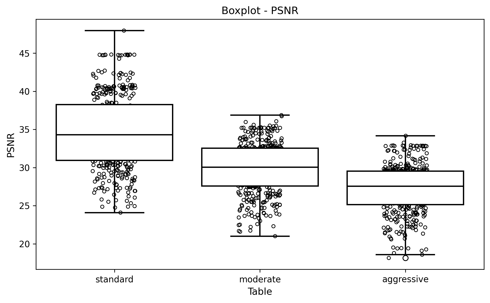
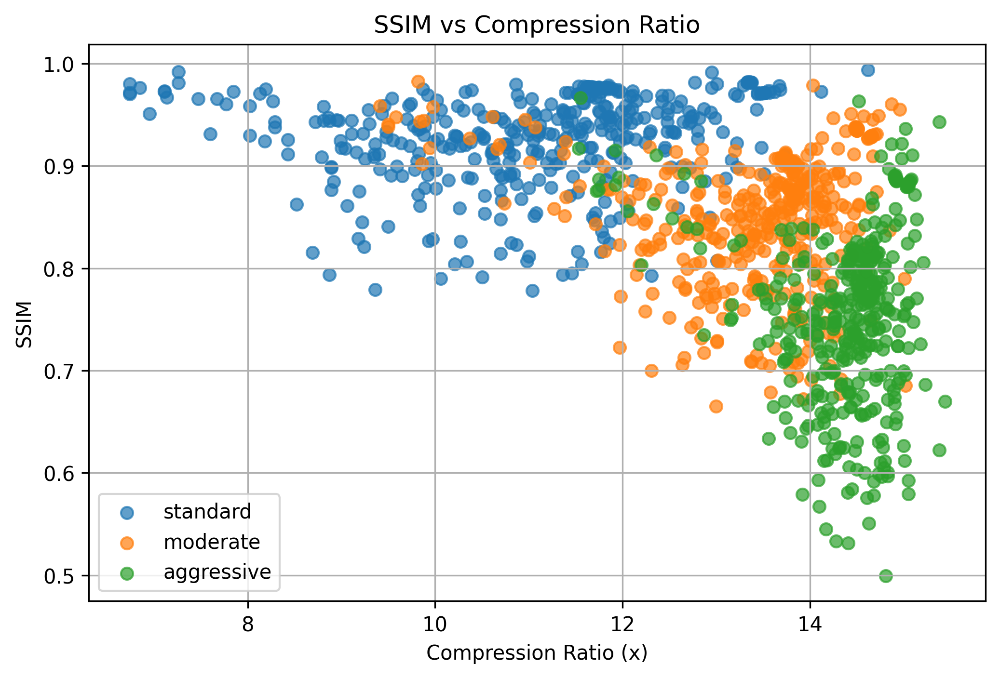
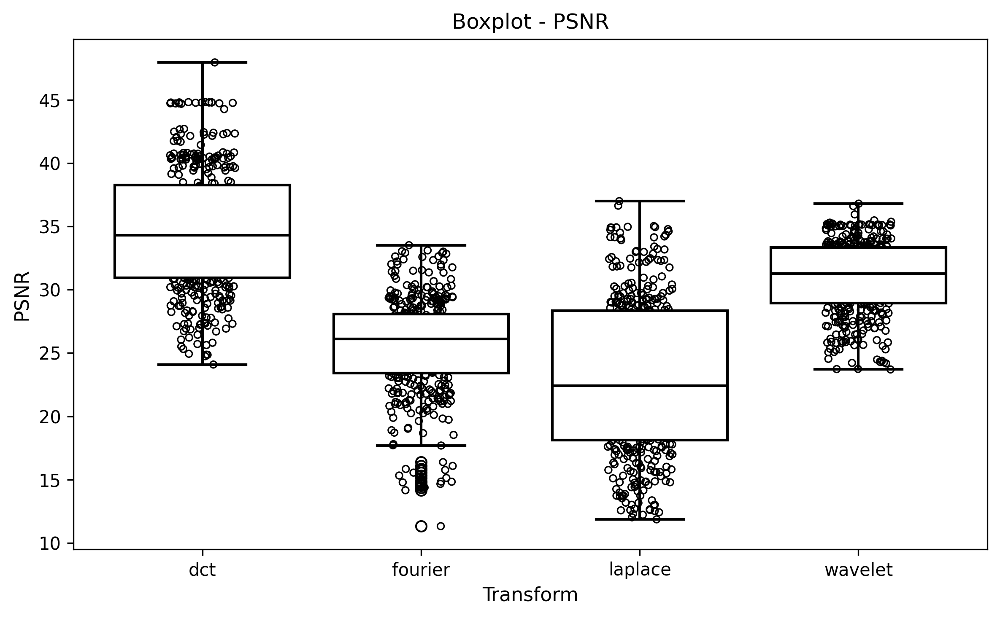
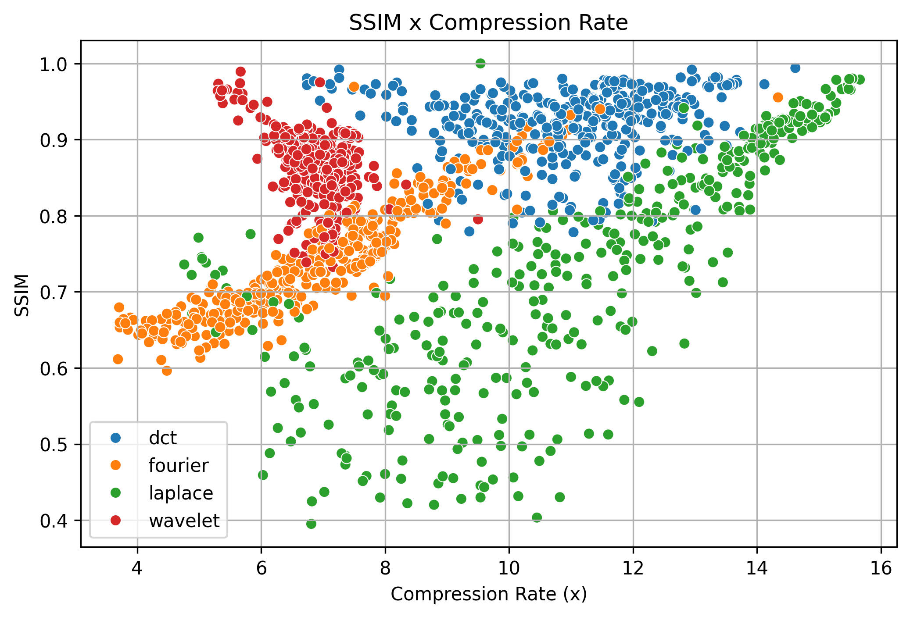

## Luís Felipe Krause de Castro

# 📦 Image Compression: JPEG and Transforms

This project implements two image compression algorithms based on the JPEG standard:

1. The file `JPEG_Algorithm_Quantization.py` runs the JPEG algorithm using three different quantization matrices:

   - **standard**: matrix used in the baseline JPEG.
   - **moderate**: intermediate compression.
   - **aggressive**: strong compression, with greater size reduction.

   For each image, the script:

   - Splits the image into **8x8 blocks**.  
   - Applies the **DCT (Discrete Cosine Transform)** to each block.  
   - Quantizes the coefficients using the selected quantization table.  
   - Reconstructs the image using **IDCT**.  
   - Computes quality and compression metrics:
     - **PSNR** (Peak Signal-to-Noise Ratio)  
     - **SSIM** (Structural Similarity Index)  
     - **% of zeroed coefficients**  
     - **Original and compressed size**  
     - **Compression ratio**  
   - Displays **comparative visualizations** between the original and reconstructed images.

2. The file `JPEG_Algorithm_Transform.py` performs compression using alternative transforms beyond DCT, allowing tests with:

   - **Fourier**
   - **Laplace**
   - **Wavelet**

   For each transform, the script:

   - Processes the image in blocks.  
   - Applies **quantization**.  
   - Reconstructs the image.  
   - Computes the same quality and compression metrics as JPEG.  
   - Generates comparative plots between the original and reconstructed images.

---

## ✨ Overview

The processing flow includes:

1. **Application of transforms**  
   - Can be **DCT**, **Fourier**, **Laplace**, or **Wavelet (Haar)**.  
   - Executed on **8x8 blocks**.

2. **Coefficient quantization**  
   - For JPEG, three quantization matrices are used: **standard**, **moderate**, and **aggressive**.

3. **Image reconstruction**  
   - The image is reconstructed from the transformed coefficients using **IDCT**, **iFFT**, or **IDWT**, depending on the transform used.

4. **Huffman compression**  
   - The quantized coefficients are encoded using **Huffman coding** to estimate the compressed file size.

5. **Quality and compression metrics**  
   - **PSNR (Peak Signal-to-Noise Ratio)**  
   - **SSIM (Structural Similarity Index)**  
   - **% of zeroed coefficients**  
   - **Compression ratio (original/compressed)**

6. **Results visualization**  
   - Comparative plots between **original** and reconstructed images.  
   - Boxplots, scatter plots, and violin plots for statistical analysis.

---

## 🧰 Technologies Used

- **Python 3** – Main language for algorithm implementation and analysis scripts.  
- **NumPy** – Matrix operations, array manipulation, and numerical computation.  
- **OpenCV** – Image reading, writing, resizing, and color conversion.  
- **Matplotlib** – Visualization of images and comparative plots.  
- **SciPy** – Implementation of DCT/IDCT and Fourier transforms.  
- **PyWavelets** – Wavelet (Haar) transforms for full-frame compression.  
- **Scikit-Image** – Computation of image quality metrics such as PSNR and SSIM.  
- **Pandas** – Storage and manipulation of results in DataFrames for analysis.  
- **Seaborn** – Generation of aesthetic statistical plots (boxplot, violin, scatter).

---

## 🖼️ Image Dataset

Images must be placed in the `./img/` directory.  
During execution, each image is automatically resized to `512x512`.

- Image datasets include:
  - **SIPI Image Database** ([link](http://sipi.usc.edu/database/))  
  - **ImageNet Sample Images** ([link](http://www.image-net.org/))  

There are 210 images from each dataset, totaling 420 images tested.

---

## ⚙️ How the Algorithm Works

### 1. 🔁 Batch Processing

The script automatically iterates through all images in the `./img/` folder and applies the configured transforms or quantization tables.

### 2. 📥 Compression and Reconstruction

For each image:

- It is divided into **8x8 blocks**.  
- The chosen transform is applied.  
- Coefficients are **quantized**.  
- The image is **reconstructed** for quality evaluation.

### 3. 🧪 Metric Calculation

After reconstruction, the following are computed:

- **PSNR** (Peak Signal-to-Noise Ratio)  
- **SSIM** (Structural Similarity Index)  
- **% of zeroed coefficients** after quantization  
- **Original vs. compressed size** (via Huffman encoding)  
- **Compression ratio**

### 4. 📦 Huffman Compression

- Quantized coefficients are concatenated.  
- A **Huffman tree** is generated.  
- The **compressed size (in bytes)** is estimated.  
- The **compression ratio (original/compressed)** is computed.

### 5. 🖼️ Visualization

For selected images (`img_comparativo`), the script displays comparisons between:

- Original image  
- Reconstructed images for each quantization table or transform  
- Quality metrics shown in figure titles

---

# 📊 Outputs

## 📈 Example Output from `JPEG_Algorithm_Quantization.py`

### Comparative Plot

  

### BoxPlot

  

### Scatter Plot

  

---

## 📈 Example Output from `JPEG_Algorithm_Transform.py`

### Comparative Plot

  

### BoxPlot

  

### Scatter Plot

  

